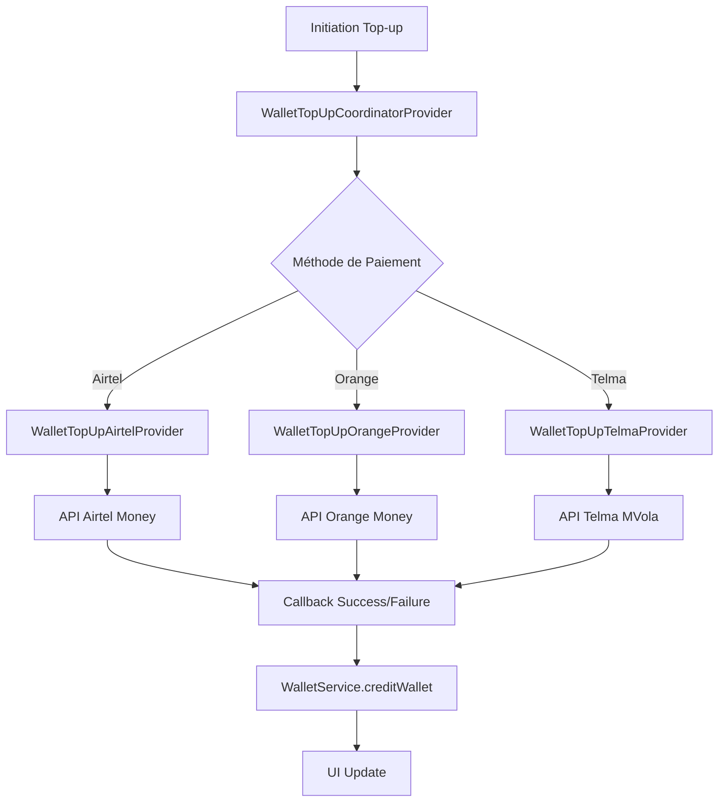

# Guide d'Intégration - Système de Top-up de Portefeuille Numérique

## Vue d'Ensemble

Ce document décrit l'implémentation des providers dédiés au top-up (rechargement) de portefeuille numérique dans l'application Misy. Le système utilise une architecture basée sur des providers spécialisés qui n'interfèrent pas avec le système de paiement de courses existant.

## Architecture Technique

### Composants Principaux

#### 1. WalletTopUpCoordinatorProvider (`lib/provider/wallet_topup_coordinator_provider.dart`)
- **Rôle** : Coordinateur central pour tous les top-ups
- **Responsabilités** :
  - Gestion de l'état global des transactions de top-up
  - Orchestration des différents providers de paiement
  - Suivi du cycle de vie des transactions
  - Interface unifiée pour l'UI

#### 2. Providers Spécialisés par Méthode de Paiement
- `WalletTopUpAirtelProvider` : Gestion des top-ups via Airtel Money
- `WalletTopUpOrangeProvider` : Gestion des top-ups via Orange Money
- `WalletTopUpTelmaProvider` : Gestion des top-ups via Telma MVola

#### 3. WalletPaymentIntegrationService (Adapté)
- **Rôle** : Pont entre les providers et le système de portefeuille
- **Modification** : Délègue maintenant au `WalletTopUpCoordinatorProvider`
- **Fonctions** : `handlePaymentSuccess()`, `handlePaymentFailure()`

## Flux de Traitement

### 1. Initiation du Top-up

```dart
// Point d'entrée depuis l'UI
WalletPaymentIntegrationService.initiateWalletTopUp(
  amount: 10000.0,
  paymentMethod: PaymentMethodType.airtelMoney,
  userId: "user123",
  phoneNumber: "0340123456",
);
```

**Séquence :**
1. Validation des paramètres (montant, limites wallet)
2. Délégation au `WalletTopUpCoordinatorProvider`
3. Sélection du provider approprié selon la méthode
4. Création du contexte de transaction
5. Appel API vers le service de paiement mobile

### 2. Traitement Asynchrone



### 3. Gestion des Callbacks

**Succès :**
```dart
WalletPaymentIntegrationService.handlePaymentSuccess(
  transactionId: "internal_txn_123",
  externalTransactionId: "airtel_txn_456",
  paymentMethod: PaymentMethodType.airtelMoney,
);
```

**Échec :**
```dart
WalletPaymentIntegrationService.handlePaymentFailure(
  transactionId: "internal_txn_123",
  paymentMethod: PaymentMethodType.airtelMoney,
  errorMessage: "Solde insuffisant",
);
```

## États des Transactions

Le système utilise l'énumération `TopUpStatus` :

- `idle` : Aucune transaction active
- `initiating` : Démarrage en cours
- `processing` : Transaction en cours de traitement
- `success` : Transaction réussie
- `failed` : Transaction échouée
- `cancelled` : Transaction annulée
- `timeout` : Transaction expirée (>10 minutes)

## Contextes de Transaction

Chaque provider maintient un contexte spécifique :

### WalletTopUpContext (Airtel)
```dart
class WalletTopUpContext {
  final String userId;
  final double amount;
  final PaymentMethodType paymentMethod;
  final String transactionId; // ID interne
  final String externalTransactionId; // ID Airtel
  final String? phoneNumber;
  final DateTime createdAt;
}
```

### WalletTopUpOrangeContext (Orange)
```dart
class WalletTopUpOrangeContext {
  final String orderId; // ID Orange
  final String? payToken;
  final String? paymentUrl;
  final String? notifyToken;
  // ... autres propriétés
}
```

### WalletTopUpTelmaContext (Telma)
```dart
class WalletTopUpTelmaContext {
  final String correlationId; // ID Telma
  final String? serverCorrelationId;
  final String? objectReferenceId;
  // ... autres propriétés
}
```

## Sécurité et Gestion d'Erreurs

### Validation des Entrées
- Montants entre `WalletConstraints.minTransactionAmount` et `WalletConstraints.maxTransactionAmount`
- Vérification des limites de solde maximum du portefeuille
- Validation des numéros de téléphone pour Airtel et Telma

### Timeout de Transactions
- **Durée maximale** : 10 minutes
- **Vérification automatique** : Toutes les 8-10 secondes selon le provider
- **Nettoyage automatique** : Contextes expirés supprimés

### Gestion des États d'Erreur
- **Retry automatique** : En cas d'erreur 401/403 (token expiré)
- **Logging complet** : Toutes les requêtes/réponses API loggées
- **Rollback** : Pas de modification du portefeuille en cas d'échec

## Intégration avec l'UI Existante

### Écran de Top-up (`WalletTopUpScreen`)
```dart
// Utilisation du service existant - aucune modification nécessaire
bool success = await WalletPaymentIntegrationService.initiateWalletTopUp(
  amount: selectedAmount,
  paymentMethod: selectedPaymentMethod,
  userId: currentUserId,
  phoneNumber: phoneNumber,
);
```

### Surveillance des États
```dart
Consumer<WalletTopUpCoordinatorProvider>(
  builder: (context, coordinator, child) {
    return Column(
      children: [
        if (coordinator.isProcessingTopUp)
          LinearProgressIndicator(),
        Text(coordinator.statusMessage),
        if (coordinator.status == TopUpStatus.failed)
          ElevatedButton(
            onPressed: () => coordinator.cancelCurrentTransaction(),
            child: Text('Réessayer'),
          ),
      ],
    );
  },
)
```

## Configuration et Déploiement

### Ajout des Providers dans main.dart
```dart
MultiProvider(
  providers: [
    // ... providers existants
    ChangeNotifierProvider(create: (_) => WalletTopUpCoordinatorProvider()),
    ChangeNotifierProvider(create: (_) => WalletTopUpAirtelProvider()),
    ChangeNotifierProvider(create: (_) => WalletTopUpOrangeProvider()),
    ChangeNotifierProvider(create: (_) => WalletTopUpTelmaProvider()),
  ],
  child: MyApp(),
)
```

### Variables d'Environnement
Les providers utilisent les mêmes clés API que les providers existants :
- `paymentGateWaySecretKeys.airtelMoneyClientId`
- `paymentGateWaySecretKeys.orangeMoneyApiSecretKey`
- `paymentGateWaySecretKeys.telmaConsumerKey`

## Monitoring et Debug

### Logs Importants
```dart
// Points de logging clés
myCustomPrintStatement('WalletTopUpCoordinatorProvider: Initiating top-up');
myCustomPrintStatement('Airtel payment successful');
myCustomPrintStatement('Transaction marked as successful');
```

### Métriques de Performance
- Temps de réponse API par provider
- Taux de succès par méthode de paiement  
- Volume de transactions par période

### Debug en Développement
```dart
// Résumé de transaction pour debug
Map<String, dynamic> summary = coordinatorProvider.getCurrentTransactionSummary();
print('Transaction Summary: $summary');
```

## Compatibilité et Migration

### Rétrocompatibilité
- ✅ Les providers de paiement de courses **ne sont pas modifiés**
- ✅ L'API `WalletPaymentIntegrationService.initiateWalletTopUp()` reste identique
- ✅ Les méthodes dépréciées sont marquées avec `@deprecated`

### Migration Progressive
1. **Phase 1** : Déploiement des nouveaux providers (complète)
2. **Phase 2** : Tests en production avec feature flag
3. **Phase 3** : Suppression des méthodes dépréciées (future)

## Tests et Validation

### Tests Unitaires
- Validation de chaque provider individuellement
- Tests des flux de succès et d'échec
- Validation des contextes de transaction

### Tests d'Intégration
- Flux complet de top-up pour chaque méthode
- Interaction entre coordinator et providers
- Mise à jour correcte du portefeuille

### Tests de Charge
- Gestion de transactions simultanées
- Performance sous charge
- Gestion des timeouts

## Troubleshooting

### Problèmes Courants

#### Transaction bloquée en "processing"
**Cause** : Timeout de l'API ou perte de connexion
**Solution** : Le système nettoie automatiquement après 10 minutes

#### Échec silencieux du paiement
**Cause** : Callback de succès/échec non reçu
**Solution** : Vérifier les logs des providers spécifiques

#### Provider non trouvé
**Cause** : Provider non enregistré dans MultiProvider
**Solution** : Vérifier la configuration dans main.dart

### Support et Maintenance
- **Logs** : Consultez `myCustomPrintStatement` pour le debug
- **État** : Utilisez `getCurrentTransactionSummary()` pour l'état actuel
- **Reset** : `cancelCurrentTransaction()` pour forcer le reset

---

## Prochaines Étapes

1. **Validation en Test** : Tester avec de vraies APIs mobile money
2. **Monitoring Production** : Mise en place de métriques détaillées
3. **Optimisations** : Amélioration des temps de réponse
4. **Extensions** : Ajout de nouveaux providers (cartes bancaires, crypto)

Ce système fournit une base solide et extensible pour le top-up de portefeuille tout en préservant l'intégrité du système de paiement de courses existant.