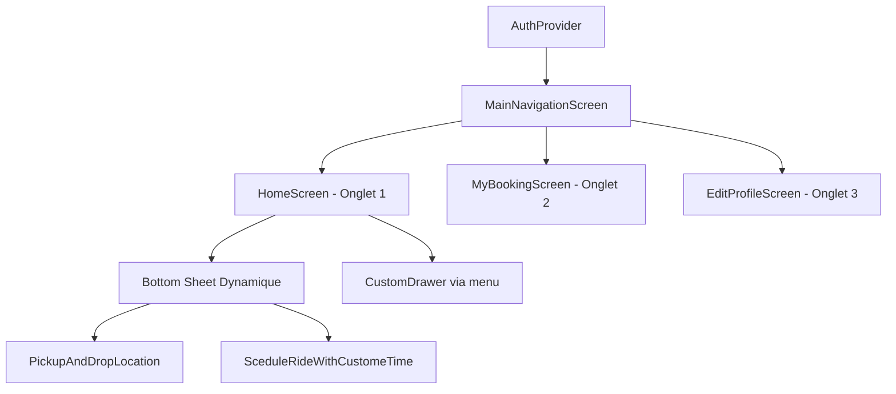

# 👨‍💻 Guide Développeur - Interface Redesign RiderApp

## 📋 Vue d'ensemble

Ce document technique permet à tout développeur de comprendre et reprendre le travail sur la nouvelle interface de RiderApp.

### 🎯 Objectif du projet
Modernisation de l'interface d'accueil de l'app de VTC RiderApp (Misy) avec un design inspiré de Bolt :
- Navigation bottom bar au lieu de drawer latéral
- Carte Google Maps en arrière-plan permanent
- Bottom sheet glissant sur 3 niveaux
- Préservation de toute la logique métier existante

---

## 🏗️ Architecture Technique

### Structure des composants principaux

```
└── lib/pages/view_module/
    ├── main_navigation_screen.dart     # Point d'entrée principal
    ├── home_screen.dart               # Écran hybride carte+bottom sheet
    ├── my_booking_screen.dart         # Écran trajets (inchangé)
    ├── profile_screen.dart            # [DEPRECATED] 
    ├── old_home_screen.dart          # Backup ancienne version
    └── home_screen_backup.dart       # Backup première version
```

### Flux de navigation



---

## 🔧 Composants Techniques Détaillés

### 1. MainNavigationScreen
**Fichier** : `lib/pages/view_module/main_navigation_screen.dart`
**Rôle** : Container principal avec bottom navigation à 3 onglets

#### Points clés :
```dart
class MainNavigationScreen extends StatefulWidget {
  // Navigation sécurisée - swipe bloqué
  PageView(
    physics: const NeverScrollableScrollPhysics(), // ← CRITIQUE
    children: _screens,
  )
  
  // Icône voiture Misy Classic
  BottomNavigationBarItem(
    icon: ImageIcon(AssetImage(MyImagesUrl.carHomeIcon)), // ← Icône custom
  )
}
```

#### Écrans gérés :
- **Onglet 1** : `HomeScreen()` - Interface principale
- **Onglet 2** : `MyBookingScreen()` - Historique trajets
- **Onglet 3** : `EditProfileScreen()` - Profil utilisateur

### 2. HomeScreen (Architecture Hybride)
**Fichier** : `lib/pages/view_module/home_screen.dart`
**Rôle** : Carte + bottom sheet intelligent avec états dynamiques

#### Architecture des couches :
```dart
Scaffold(
  drawer: const CustomDrawer(),              // ← Drawer restauré
  body: Stack([
    _buildGoogleMap(mapProvider),            // ← Carte arrière-plan
    Positioned(                              // ← Bottom sheet
      child: Container(
        child: _buildBottomSheetContent(),   // ← Contenu conditionnel
      ),
    ),
    Positioned(...menuButton),              // ← Bouton menu flottant
    Positioned(...locationButton),          // ← Bouton géolocalisation
  ]),
)
```

#### Gestion des états intelligente :
```dart
Widget _buildBottomSheetContent(DarkThemeProvider darkTheme, TripProvider trip) {
  return Column([
    GestureDetector(...),                    // ← Zone glissement 60px × full width
    Expanded(
      child: trip.currentStep == null
          ? _buildDefaultContent()           // ← Interface moderne par défaut
          : trip.currentStep == CustomTripType.choosePickupDropLocation
              ? PickupAndDropLocation()      // ← Page saisie adresses
              : trip.currentStep == CustomTripType.selectScheduleTime  
                  ? SceduleRideWithCustomeTime() // ← Page réservation
                  : _buildDefaultContent(),  // ← Fallback sécurisé
    ),
  ]);
}
```

### 3. Bottom Sheet à 3 Niveaux
#### Configuration des hauteurs :
```dart
static const double _minBottomSheetHeight = 0.35; // 35% - Niveau bas
static const double _midBottomSheetHeight = 0.60; // 60% - Niveau moyen  
static const double _maxBottomSheetHeight = 0.90; // 90% - Niveau plein écran
```

#### Gestion des gestes :
```dart
GestureDetector(
  onPanUpdate: (details) {
    final delta = -details.delta.dy / screenHeight;
    final newHeight = (_currentBottomSheetHeight + delta)
        .clamp(_minBottomSheetHeight, _maxBottomSheetHeight);
    setState(() => _currentBottomSheetHeight = newHeight);
  },
  onPanEnd: (details) {
    // Snapping intelligent vers le niveau le plus proche
    final velocity = details.velocity.pixelsPerSecond.dy;
    // Logique de snapping avec vélocité...
  },
)
```

---

## 🔄 Logique Métier Préservée

### TripProvider Integration
Le système préserve 100% de la logique du `TripProvider` existant :

```dart
// États supportés :
CustomTripType.setYourDestination       → Interface par défaut
CustomTripType.choosePickupDropLocation → Page saisie adresses  
CustomTripType.selectScheduleTime       → Page réservation planifiée
CustomTripType.chooseVehicle           → [À implémenter si besoin]
CustomTripType.payment                 → [À implémenter si besoin]
// ... autres états selon besoins
```

### Transitions d'état :
```dart
// Déclenchement depuis l'interface
Provider.of<TripProvider>(context, listen: false)
    .setScreen(CustomTripType.choosePickupDropLocation);

// Le bottom sheet détecte automatiquement et affiche le bon widget
```

---

## 🎨 Personnalisation et Styling

### Thème sombre/clair supporté
```dart
Consumer<DarkThemeProvider>(
  builder: (context, darkThemeProvider, child) {
    final isDark = darkThemeProvider.darkTheme;
    return Container(
      color: isDark ? MyColors.blackColor : MyColors.whiteColor,
      // ...
    );
  },
)
```

### Couleurs principales :
- `MyColors.primaryColor` - Couleur principale Misy
- `MyColors.blackColor` / `MyColors.whiteColor` - Thème adaptatif
- `MyImagesUrl.carHomeIcon` - Icône voiture Misy Classic

---

## 🧪 Tests et Validation

### Points de test critiques :
1. **Navigation** : Vérifier que le swipe est bloqué
2. **Bottom sheet** : Tester les 3 niveaux de glissement
3. **Redirections** : Valider tous les boutons et champs clicables
4. **Drawer** : Confirmer l'ouverture via le bouton menu
5. **États** : Tester les transitions TripProvider

### Logs de debug utiles :
```dart
myCustomPrintStatement("the sreen is going to change ${tripProvider.currentStep}");
```

### Commandes de test :
```bash
fvm flutter analyze lib/pages/view_module/  # Vérification syntaxe
fvm flutter run                             # Test complet
fvm flutter hot-reload                      # Test rapide après modification
```

---

## 🐛 Debugging Guide

### Problèmes courants et solutions :

#### 1. "Bottom sheet ne glisse pas"
- **Cause** : Zone tactile trop petite
- **Solution** : Vérifier `height: 60` et `width: double.infinity` dans le GestureDetector

#### 2. "Boutons non clicables"
- **Cause** : Conflit entre GestureDetector et InkWell
- **Solution** : Utiliser `InkWell` + `Material` pour les boutons dans les zones de geste

#### 3. "Navigation ne fonctionne pas"
- **Cause** : TripProvider non initialisé
- **Solution** : Vérifier l'appel `setScreen(CustomTripType.setYourDestination)` dans initState

#### 4. "Page blanche après clic"
- **Cause** : Widget non importé ou état non géré
- **Solution** : Ajouter l'import et l'état dans `_buildBottomSheetContent`

---

## 📚 Dépendances et Imports

### Imports critiques pour HomeScreen :
```dart
import 'package:rider_ride_hailing_app/bottom_sheet_widget/pickup_and_drop_location_sheet.dart';
import 'package:rider_ride_hailing_app/bottom_sheet_widget/schedule_ride_with_custom_time.dart';
import 'package:rider_ride_hailing_app/contants/global_keys.dart';
import 'package:rider_ride_hailing_app/widget/custom_drawer.dart';
import 'package:rider_ride_hailing_app/contants/global_data.dart';
```

### Packages utilisés :
- `provider` - État global (TripProvider, DarkThemeProvider, GoogleMapProvider)
- `google_maps_flutter` - Intégration carte
- Tous les widgets bottom sheet existants de l'app

---

## 🔄 Évolutions Futures

### Points d'extension identifiés :

1. **Nouveaux états TripProvider** :
   ```dart
   // Ajouter dans _buildBottomSheetContent :
   : tripProvider.currentStep == CustomTripType.chooseVehicle
       ? ChooseVehicle(...)
       : // ... autres états
   ```

2. **Nouveaux niveaux de bottom sheet** :
   ```dart
   // Modifier les constantes :
   static const double _extraLevelHeight = 0.75; // Niveau intermédiaire
   ```

3. **Animations personnalisées** :
   ```dart
   // Modifier _bottomSheetController pour des animations custom
   ```

### Fichiers à ne pas modifier :
- `old_home_screen.dart` - Backup critique
- `TripProvider` - Logique métier stable
- `CustomDrawer` - Fonctionnalité préservée

---

## 🚀 Checklist Mise en Production

### Avant déploiement :
- [ ] Tests sur iOS et Android
- [ ] Validation des performances avec la carte permanente
- [ ] Tests avec différents états de connection réseau
- [ ] Validation du flow complet de réservation
- [ ] Tests en mode sombre et clair
- [ ] Validation des traductions (FR/MG/EN)

### Monitoring post-déploiement :
- Temps de chargement de la carte
- Taux d'utilisation des 3 niveaux de bottom sheet
- Erreurs dans le flow de réservation
- Feedback utilisateur sur la nouvelle navigation

---

## 📞 Support Développeur

### Contacts :
- **Architecture originale** : Équipe RiderApp/Misy
- **Redesign** : Claude Code (documentation complète dans ce repo)

### Ressources :
- Documentation complète : `/doc/phase2_suivi/`
- Feedback testeurs : `/doc/phase2_suivi/feedback_testeurs.md`
- Commits : `git log --oneline | grep "feat(ui)\|fix(ux)"`

---

*Document créé le 06/07/2025 - Version 1.0*  
*Dernière mise à jour : 06/07/2025 après corrections feedback testeurs*